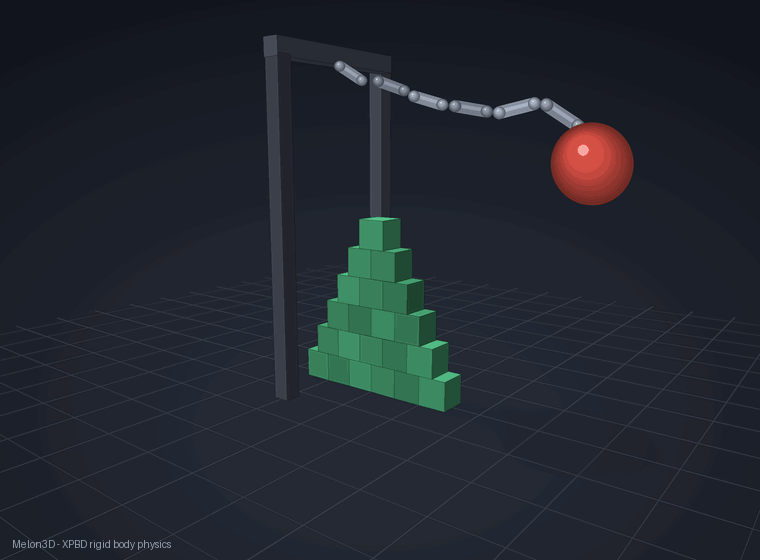

# Melon3D

[](https://github.com/MelonWithGlasses/Melon3D/actions/workflows/ci.yml)
[](LICENSE)
[](https://en.cppreference.com/w/cpp/17)
[](#building)

A compact 3D rigid body physics engine for games, built on **position-based
dynamics (XPBD)**. Zero dependencies, C-style API, C++17 inside,
deterministic multithreading out of the box.

```
~6k lines · MIT · sphere / capsule / box · 4 joint types · filtering ·
sensors · sleeping · ray & sphere casts · single-file build available
```



*A wrecking ball on a chain of ball joints demolishes a box pyramid, then
a rain of spheres, capsules and boxes settles over the debris — all
simulated by Melon3D (rendering is a small offline script, see
[`examples/`](examples/)).*

## Why another physics engine?

Melon3D deliberately explores the *other* branch of the design tree from
the impulse/warm-starting school (Box2D, box3d, PhysX):

| | Impulse solvers | Melon3D |
|---|---|---|
| Constraint level | velocity | **position (XPBD)** |
| Rest penetration | slop-bounded overlap | **exactly zero** |
| Warm-start state | persistent impulses | **none** |
| Broadphase | incremental BVH | **two-tier hash grid** |
| Threading model | task scheduler (bring your own) | **built-in pool, deterministic** |

The result has a different performance signature: it shines on streaming
workloads (constant spawn/despawn) and worst-frame latency, and pays a
premium on piles that settle and sleep. Honest numbers below.

## Features

- **Shapes**: sphere, capsule, box (OBB), one shape per body
- **Broadphase**: two-tier sorted spatial hash grid — sleeping and static
  bodies live in a *stable* tier rebuilt only on membership changes;
  moved-only pair updates via persistent fat AABBs with a one-step
  velocity prediction (fast bodies always pair before impact — no
  tunneling, verified by test)
- **Narrowphase**: SAT box-box with reference-face clipping, capsule
  closest-point via convex ternary search; manifolds cached by pose delta
  (1 mm / 1 mrad); speculative margins scaled by relative velocity
- **Solver**: XPBD substepping (Müller et al. 2020)
  - persistent **stiction anchors** for static friction — no creep, no
    sway pumping, piles come to a true stop and sleep
  - **friction validated against closed-form mechanics**: static hold
    exactly at the Coulomb cone (with a realistic ~1.1× static-vs-kinetic
    ratio), sliding at `g(sinθ − μcosθ)` to 5%, solid spheres rolling
    downhill at `5/7·g·sinθ` to 1%, backspin converting at `v = 2/7·ωr`
  - **implicit gyroscopic torque** — tumbling bodies precess and show the
    intermediate-axis (Dzhanibekov) flip; exact exponential-map rotation
    integration keeps fast tumbles' angular momentum
  - per-substep frozen effective masses and angular Jacobians; geometric
    contact arms for curved shapes (no phantom rolling torque)
  - depenetration capped at 3 m/s; separate restitution/dynamic-friction
    velocity pass
  - **rolling resistance** for spheres/capsules (per-shape, default on)
- **Islands & sleeping**: union-find islands, whole-island sleep/wake
- **Big-island parallelism**: islands with 300+ contacts are solved with
  **graph coloring** — contacts bucketed so no two in a bucket share a
  dynamic body — and **8-wide SIMD contact packets** (branchless
  `float[8]` lane code, fully autovectorized with AVX2)
- **Threading**: built-in spin fork-join pool (~1–2 µs stage dispatch);
  per-color stages below a size threshold run inline, skipping the
  barrier when it would cost more than the work. Simulation results are
  **bit-identical for any worker count** — the colored path is selected
  by island size, never by thread count, and bodies within a color are
  disjoint (covered by a test). Results are also independent of prior
  heap contents: no solver path ever reads an indeterminate byte
  (validated by an allocator-poisoning harness that fills every
  allocation with 0x00 / 0xFF / garbage and checks state checksums match)
- **Joints**: distance (rigid or spring via XPBD compliance), ball,
  **hinge** (with angle limit and torque-limited motor), **weld** — all
  solved positionally, so they don't stretch under load
- **Filtering & sensors**: Box2D-style category/mask/group filtering
  resolved at pair creation (filtered pairs cost nothing); sensor shapes
  report begin/end events without generating forces
- **Forces**: per-step force/torque accumulators, impulses at a point,
  angular impulses, per-body gravity scale
- **Queries & events**: contact begin/end events (with sensor flag), DDA
  grid ray casting (plus filtered variant), **sphere casts** (exact vs
  spheres/capsules, conservative advancement vs boxes), AABB overlap
  visitor, per-stage profiling (`m3d_world_profile`)

See the **[developer guide](docs/GUIDE.md)** for recipes: character
controllers, triggers, ragdoll filtering, motors, tuning.

## Building

```sh
cmake -S . -B build -DCMAKE_BUILD_TYPE=Release
cmake --build build
build/melon3d_tests   # 52 checks, incl. closed-form physics laws
build/melon3d_bench   # benchmark scenes
```

GCC / Clang / MSVC, Windows / Linux / macOS. No dependencies.

Or consume it directly from CMake:

```cmake
include(FetchContent)
FetchContent_Declare(melon3d
    GIT_REPOSITORY https://github.com/MelonWithGlasses/Melon3D.git GIT_TAG main)
FetchContent_MakeAvailable(melon3d)
target_link_libraries(my_game PRIVATE melon3d::melon3d)
```

Or go build-system-free: `python tools/amalgamate.py` produces a
**single-file build** (`melon3d_single.cpp` + `melon3d.h` — drop both into
any project and compile one file).

## Quick start

```c
#include "melon3d.h"

m3d_world_def wd = m3d_world_def_default();
wd.workerCount = 4;                    // parallel, still deterministic
m3d_world* world = m3d_world_create(&wd);

m3d_body_def ground = m3d_body_def_default();   // static by default
ground.position = m3d_v3(0.0f, -1.0f, 0.0f);
m3d_shape_def gs = m3d_shape_def_default();
gs.type = M3D_SHAPE_BOX;
gs.halfExtents = m3d_v3(50.0f, 1.0f, 50.0f);
m3d_body_create(world, &ground, &gs);

m3d_body_def bd = m3d_body_def_default();
bd.type = M3D_BODY_DYNAMIC;
bd.position = m3d_v3(0.0f, 5.0f, 0.0f);
m3d_shape_def sd = m3d_shape_def_default();
sd.type = M3D_SHAPE_BOX;
sd.halfExtents = m3d_v3(0.5f, 0.5f, 0.5f);
m3d_body_id box = m3d_body_create(world, &bd, &sd);

for (int i = 0; i < 60; ++i)
    m3d_world_step(world, 1.0f / 60.0f, 4);     // 4 substeps

m3d_vec3 p = m3d_body_position(world, box);
m3d_world_destroy(world);
```

## Benchmarks vs box3d

[box3d](https://github.com/erincatto/box3d) is Erin Catto's 3D physics
engine — the natural reference point for this project and the inspiration
for several of its scenes. The comparison below is offered in that spirit:
one data point of XPBD-vs-impulse trade-offs, not a leaderboard.

### Setup (full disclosure)

| | |
|---|---|
| CPU | AMD Ryzen 7 7735HS (8 cores / 16 threads, Zen 3+) |
| RAM | 16 GB DDR5 |
| OS | Windows 10 Pro |
| Compiler | GCC 15.2.0 (MSYS2 ucrt64), `-O3 -mavx2 -mfma` **for both engines** |
| box3d version | commit `1bec63c` (July 2026) |
| Timestep | 60 Hz, 4 substeps, identical scenes/step counts/PRNG seeds |
| Timing | wall time around the full step; churn also times create/destroy |
| Runs | two consecutive runs per engine, averaged; run-to-run spread ≈ ±5% |

**Important**: box3d runs **single-threaded** in this harness because its
task-system callbacks are not wired here. box3d supports multithreading
when a task scheduler is provided, so read the table as "Melon3D with its
built-in pool vs box3d out-of-the-box in this harness" — not as an upper
bound of what box3d can do. Melon3D single-thread numbers are included so
both engines can also be compared 1T vs 1T.

### Results — average ms per step (worst frame in parentheses)

Numbers are for **v1.2.2** (determinism hardening + inline small solver
stages), measured 2026-07-16. The v1.2 realism audit still applies:
friction is measured-correct (Coulomb cone, rolling laws, gyroscopics),
so scenes do genuine physical work — bodies really slide and roll before
settling instead of being glued by an inflated friction clamp.

| Scene | box3d 1T | Melon3D 1T | Melon3D 16T |
|---|---|---|---|
| **churn** — 1500 bodies raining, 25 destroyed+respawned each step | 1.251 (1.87) | **1.18 (1.9)** | **0.60 (1.3)** |
| **rain** — 1000 mixed spheres/capsules/boxes falling | 0.971 (2.20) | 1.34 (4.2) | **0.78 (3.2)** |
| **stacks** — 8×8 grid of 6-box towers (384 bodies) | **0.046** (0.93) | 0.21 (1.9) | 0.049 (0.85) |
| **towers** — 20×20 grid of 3-box towers (1200 bodies) | **0.140** (2.83) | 0.65 (6.0) | 0.140 (2.1) |
| **pyramid** — 210-box pyramid, one contact island | **0.122** (1.45) | 0.32 (2.2) | 0.36 (2.5) |

Fixed per-step cost of a fully-settled (asleep) scene, Melon3D 8 threads —
a scaling metric, not a box3d comparison: 2400 boxes ≈ 0.08 ms, 8000
boxes ≈ 0.20 ms, 18000 boxes ≈ 0.44 ms. Large mostly-static levels stay
cheap because sleeping bodies are skipped down to a few compact sidecar
scans.

<details>
<summary>Raw per-run data (v1.2.2, 2026-07-16)</summary>

```
box3d 1T          run1 avg/max      run2 avg/max
pyramid           0.121 / 1.454     0.123 / 1.437
stacks            0.045 / 0.952     0.046 / 0.909
rain              0.950 / 1.977     0.991 / 2.430
towers            0.138 / 2.731     0.142 / 2.921
churn             1.259 / 1.719     1.242 / 2.027

Melon3D 16T       run1 avg/max      run2 avg/max
pyramid           0.387 / 3.760     0.339 / 2.373
stacks            0.050 / 0.888     0.047 / 0.820
rain              0.818 / 3.712     0.745 / 2.805
towers            0.142 / 1.999     0.138 / 2.127
churn             0.621 / 1.086     0.585 / 1.449

Melon3D 1T        run1 avg/max      run2 avg/max
pyramid           0.330 / 2.176     0.318 / 2.222
stacks            0.211 / 1.916     0.205 / 1.810
rain              1.383 / 4.629     1.294 / 3.756
towers            0.666 / 6.079     0.630 / 5.917
churn             1.207 / 1.876     1.147 / 1.814
```
</details>

### Reading the numbers

- **Churn** (streaming spawn/despawn) is Melon3D's scene, ~52% faster
  than box3d with better worst-frame latency — allocation-free stage
  dispatch, a hash grid indifferent to body lifetime, no warm-start state
  to rebuild, per-step (not per-substep) collision, and parallel
  candidate-pair enumeration. Even single-threaded Melon3D now edges
  box3d here.
- **Rain** is ~20% ahead, **stacks and towers** at parity. These numbers
  carry the honest cost of the v1.2 realism audit — with the friction
  clamp fixed, piles genuinely slide and roll while settling, and fast
  tumbles pay for the gyroscopic term — recovered through the parallel
  broadphase enumeration, cheaper hot-loop math (v1.2.1), and running
  small per-color solver stages inline instead of paying fork-join
  barriers (v1.2.2; bit-identical results, big win on many-small-island
  scenes like rain).
- **Pyramid** (one big contact island) is box3d's, ~3× on average. It is
  dominated by *settle time*, not step speed: box3d's warm-started solver
  drives residual velocities below the sleep threshold in fewer frames, so
  the pile sleeps sooner.
- **Large sleeping scenes**: the per-step cost of a fully-settled scene is
  a few compact array scans, so tens of thousands of at-rest bodies stay
  affordable (see the fixed-cost figures above).
- **Physics accuracy is benchmarked too**: the test suite checks Coulomb
  cone onset, `g(sinθ−μcosθ)` sliding, `5/7·g·sinθ` rolling, `2/7·ωr`
  spin conversion and the Dzhanibekov flip against closed-form mechanics
  on every CI run.

Reproduction: [`bench_compare/`](bench_compare/README.md) contains a
harness that runs the identical scenes on box3d, with full build
instructions.

## Step pipeline

1. **Broadphase** — refresh fat AABBs of awake bodies (breach test uses a
   one-step velocity prediction), rebuild the active grid tier; stable
   tier only on membership changes.
2. **Pairs** *(parallel)* — active×active and active×stable candidates
   from shared cells, enumerated in parallel over cell-run chunks
   (min-corner deduplication, only pairs with a *moved* body are
   re-examined), then created serially in chunk order so contact order is
   worker-count independent; oversized bodies (e.g. the ground) via a
   coarse list.
3. **Narrowphase** *(parallel when there is real work)* — regenerate
   manifolds only for pairs whose bodies moved 1 mm / 1 mrad; stiction
   anchors are inherited across regenerations by feature id.
4. **Islands** — union-find over touching dynamic pairs and joints.
5. **Solve** — big islands: graph-colored, 8-wide SIMD packets; small
   islands: one task each. Per substep: integrate → per-substep manifold
   refresh → project normals (2 iterations) → stiction friction →
   velocity reconstruction → restitution/dynamic-friction pass.
6. **Sleeping** — islands quiet for 0.5 s sleep and migrate to the stable
   broadphase tier.

## Field notes

Hard-won implementation lessons are documented in
[docs/LESSONS.md](docs/LESSONS.md) — friction anchor inheritance, why
freezing residual anchors explodes while freezing response Jacobians is
fine, the lock-free pool straggler race, and when graph coloring starts
to pay.

## Roadmap

- SIMD packets for the friction and velocity passes
- Convex hulls (GJK/EPA), prismatic joint
- Multiple shapes per body
- Optional cross-step warm starting for faster pile settling

## License

MIT — see [LICENSE](LICENSE).

box3d is © Erin Catto, MIT licensed, and is not included in this
repository; the comparison harness downloads it separately.
